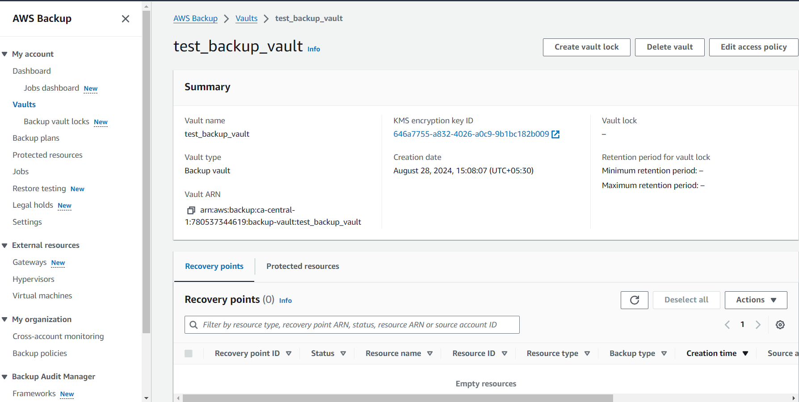
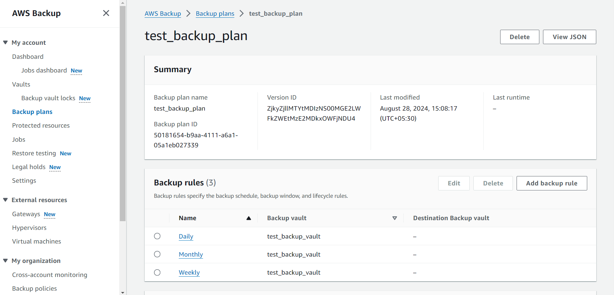
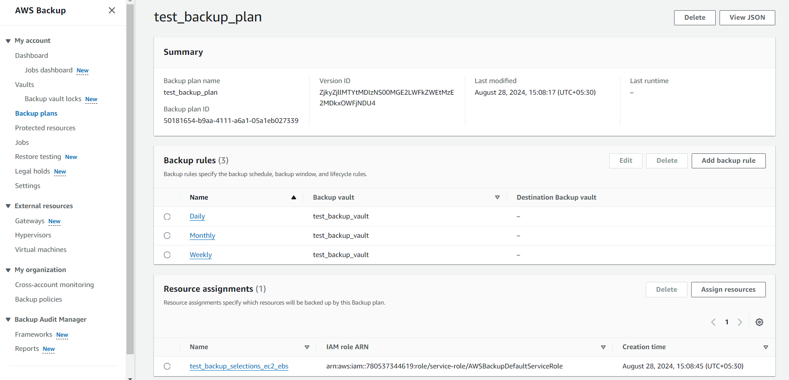
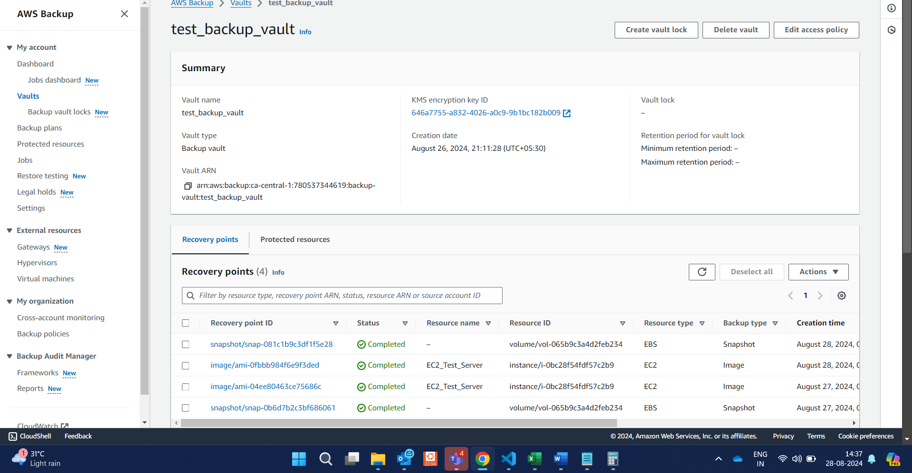
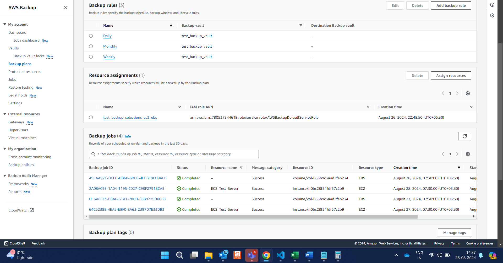

## Boto3 Module Usage in the codelines 
#####  Pass the function variable arguments as necessary for given three code *.py files

Run the code one after other - 
>(python3_virtualenv) usman@KL-63JTG24:~aws_services_operations$ python3 1a_sandbox_ca-central-1_backup_vault_creation.py 
2024-08-28 15:08:04,358 - INFO - Loading cached SSO token for cu-sandbox05-sa
646a7755-a832-4026-a0c9-9b1bc182b009
2024-08-28 15:08:06,582 - INFO - aws_backup_TargetKeyId :  646a7755-a832-4026-a0c9-9b1bc182b009
arn:aws:kms:ca-central-1:780537344619:alias/aws/backup
2024-08-28 15:08:06,582 - INFO - aws_backup_AliasArn :  arn:aws:kms:ca-central-1:780537344619:alias/aws/backup
2024-08-28 15:08:08,119 - INFO - {'ResponseMetadata': {'RequestId': 'da67dd5e-f1a0-4150-ab39-493a8dc94dba', 'HTTPStatusCode': 200, 'HTTPHeaders': {'date': 'Wed, 28 Aug 2024 09:38:07 GMT', 'content-type': 'application/json', 'content-length': '162', 'connection': 'keep-alive', 'x-amzn-requestid': 'da67dd5e-f1a0-4150-ab39-493a8dc94dba'}, 'RetryAttempts': 0}, 'BackupVaultName': 'test_backup_vault', 'BackupVaultArn': 'arn:aws:backup:ca-central-1:780537344619:backup-vault:test_backup_vault', 'CreationDate': datetime.datetime(2024, 8, 28, 15, 8, 7, 881000, tzinfo=tzlocal())}

>(python3_virtualenv) usman@KL-63JTG24:~//aws_services_operations$ python3 2a_sandbox_ca-central-1_backup_plan_creation.py 
2024-08-28 15:08:15,680 - INFO - Loading cached SSO token for cu-sandbox05-sa
2024-08-28 15:08:17,800 - INFO - Response :  {'ResponseMetadata': {'RequestId': '6ec076b6-7b43-43c2-aac1-d32272c3176d', 'HTTPStatusCode': 200, 'HTTPHeaders': {'date': 'Wed, 28 Aug 2024 09:38:17 GMT', 'content-type': 'application/json', 'content-length': '288', 'connection': 'keep-alive', 'x-amzn-requestid': '6ec076b6-7b43-43c2-aac1-d32272c3176d'}, 'RetryAttempts': 0}, 'BackupPlanId': '50181654-b9aa-4111-a6a1-05a1eb027339', 'BackupPlanArn': 'arn:aws:backup:ca-central-1:780537344619:backup-plan:50181654-b9aa-4111-a6a1-05a1eb027339', 'CreationDate': datetime.datetime(2024, 8, 28, 15, 8, 17, 583000, tzinfo=tzlocal()), 'VersionId': 'ZjkyZjllMTYtMDIzNS00MGE2LWFkZWEtMzE2MDkxOWFjNDU4'}

>(python3_virtualenv) usman@KL-63JTG24:~/aws_services_operations$ python3 2a_sandbox_ca-central-1_backup_plan_creation.py 
2024-08-28 15:08:15,680 - INFO - Loading cached SSO token for cu-sandbox05-sa
2024-08-28 15:08:17,800 - INFO - Response :  {'ResponseMetadata': {'RequestId': '6ec076b6-7b43-43c2-aac1-d32272c3176d', 'HTTPStatusCode': 200, 'HTTPHeaders': {'date': 'Wed, 28 Aug 2024 09:38:17 GMT', 'content-type': 'application/json', 'content-length': '288', 'connection': 'keep-alive', 'x-amzn-requestid': '6ec076b6-7b43-43c2-aac1-d32272c3176d'}, 'RetryAttempts': 0}, 'BackupPlanId': '50181654-b9aa-4111-a6a1-05a1eb027339', 'BackupPlanArn': 'arn:aws:backup:ca-central-1:780537344619:backup-plan:50181654-b9aa-4111-a6a1-05a1eb027339', 'CreationDate': datetime.datetime(2024, 8, 28, 15, 8, 17, 583000, tzinfo=tzlocal()), 'VersionId': 'ZjkyZjllMTYtMDIzNS00MGE2LWFkZWEtMzE2MDkxOWFjNDU4'}

#############################################################

#Post backup Rule triggers as per the cron the resources will be backed up into vault based on tags mentioned for both ec2 and ebs volumes

