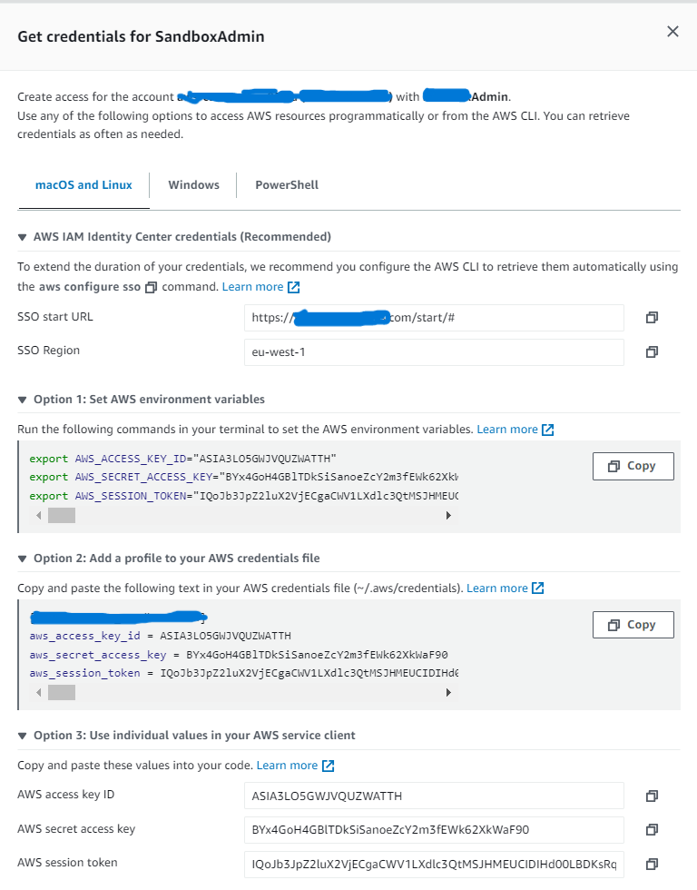
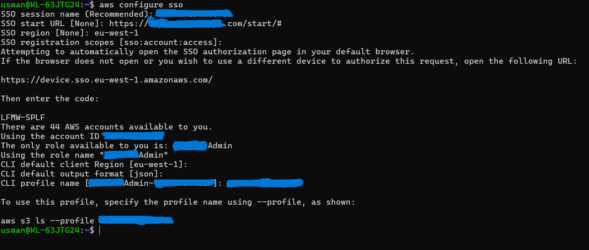
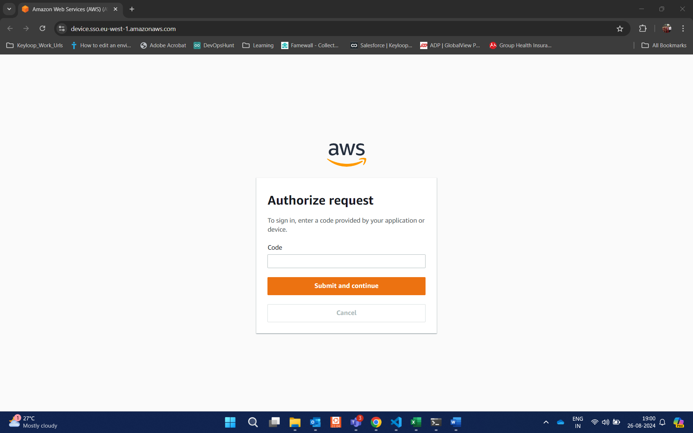

## Configuring AWS Creds Locally SSO Method
#####  Open the AWS_SSO startup URL Page and select the account that you have access. Here is a reference attached below : 



- Configure the credentials as shown in the below image :
```
aws configure sso
```






##### once authenciation made, Export the profile you have set
```
#export AWS_PROFILE=<test_profile>
```
Test the AWS CLI Access
Ex commands :
```
aws backup get-backup-plan --backup-plan-id <aws_somename_*****-99c3-e69*****ad> --region ap-northeast-1 --profile <Profile_Name>

aws backup list-backup-jobs --by-backup-vault-name <aws_backup_vault_name> --region ap-northeast-1 --profile <Profile_Name>

aws backup list-backup-selections --backup-plan-id <_*****-99c3-e69*****ad1> --region ap-northeast-1 --profile <Profiile_Name>

```
### Some times you might encounter this error as below wrt Timezone issues
> "I have error The difference between the request time and the current time is too large when call method ******"

### you can overcome this issue by applying these common steps

Source: https://stackoverflow.com/questions/4770635/s3-error-the-difference-between-the-request-time-and-the-current-time-is-too-la

The clock is out of sync
```
sudo ntpdate ntp.ubuntu.com
sudo apt-get install ntp
```
>If at any time you get a message saying the NTP socket is still in use, stop it with sudo /etc/init.d/ntp stop and re-run your command.